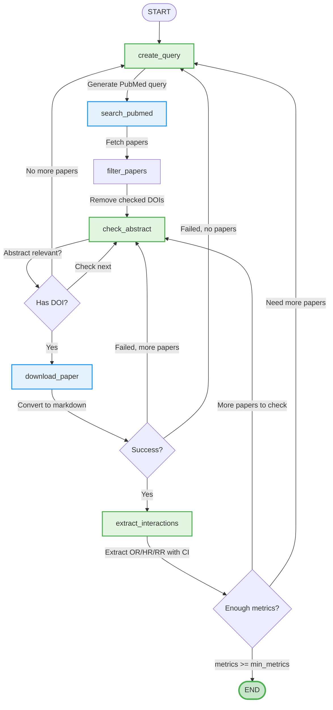

this is a project for the "Agentic AI Against Aging" hackathon

## Implementation
### Paper Discovery & Risk Metric Extraction Pipeline

The system uses a LangGraph workflow to automatically find research papers and extract risk metrics linking menopause timing to health outcomes.

**Key Components:**
- **create_query** (AI): Generates PubMed search queries for menopause timing × health outcomes
- **search_pubmed** (Tool): Fetches up to 100 papers from PubMed API
- **filter_papers**: Removes already-checked DOIs to avoid duplicates
- **check_abstract** (AI): Evaluates abstract relevance before downloading
- **download_paper** (Tool): Downloads PDF via DOI and converts to markdown
- **extract_interactions** (AI): Extracts risk metrics (OR/HR/RR) with 95% CI using tool calls

**Loop Behavior:**
- Continues until `metrics_count >= min_metrics`
- Tries different queries if current search exhausted
- Tracks checked DOIs and tried queries to avoid repetition