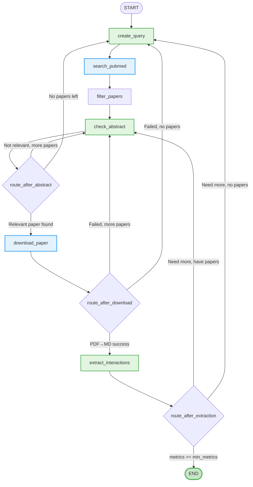

this is a project for the "Agentic AI Against Aging" hackathon

## Implementation
### Paper Discovery & Risk Metric Extraction Pipeline

The system uses a LangGraph workflow to automatically find research papers and extract risk metrics linking menopause timing to health outcomes.

**Nodes:**
- **create_query** (AI): Generates PubMed search queries, adapts if previous queries exhausted
- **search_pubmed** (Tool): Fetches up to 100 papers from PubMed API
- **filter_papers**: Removes already-checked DOIs to avoid duplicates
- **check_abstract** (AI): Evaluates abstract relevance (yes/no decision)
- **download_paper** (Tool): Downloads PDF via DOI → converts to markdown using `pymupdf4llm`
- **extract_interactions** (AI): Uses tool calls to extract risk metrics (OR/HR/RR with 95% CI)

**Routing Logic:**
- **route_after_abstract**: If relevant → download | if more papers → check next | else → new query
- **route_after_download**: If PDF→MD success → extract | if more papers → check next | else → new query  
- **route_after_extraction**: If enough metrics → END | if more papers → check next | else → new query

**State Tracking:**
- `checked_dois`: Prevents re-processing papers
- `tried_queries`: Enables query diversification
- `metrics_count`: Tracks progress toward `min_metrics` goal