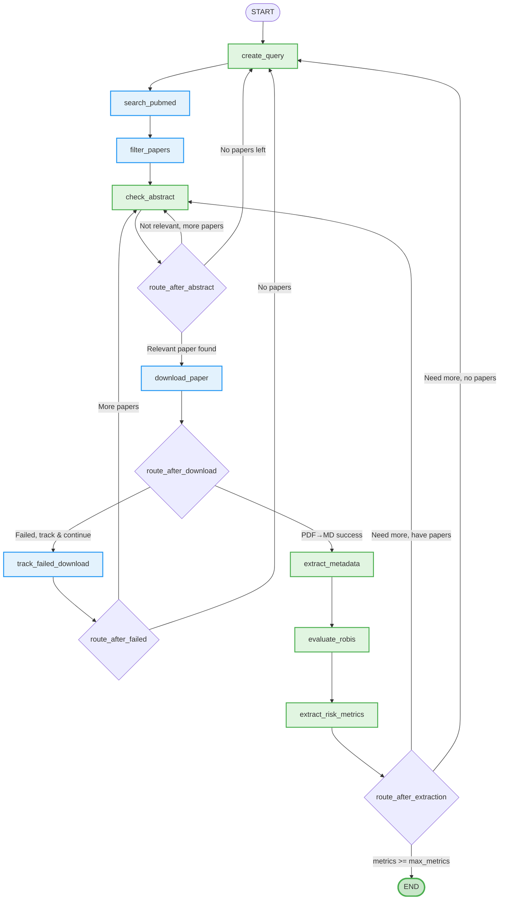

# Menopause Timing & Health Outcomes Research Agent

An autonomous AI system for discovering and extracting risk metrics from research papers linking menopause timing to health outcomes. Built for the "[Agentic AI Against Aging](https://www.hackaging.ai/)" hackathon.

📄 **[Read the full whitepaper](whitepaper/whitepaper.pdf)** for detailed methodology and results, or **[check the website](http://menopauselater.com)** for a beautiful visualization.

## Overview

This project automates the systematic review process for menopause research by:
- 🔍 **Discovering** relevant meta-analyses from PubMed
- 📄 **Downloading** open-access PDFs
- 📊 **Extracting** risk metrics (OR, HR, RR) with confidence intervals
- ✅ **Evaluating** study quality using ROBIS criteria
- 💾 **Storing** structured data for analysis

**Target Health Outcomes:**
- All Cause Mortality
- Type 2 Diabetes
- Cardiovascular Disease
- All Cause Dementia
- Osteoporosis & Fractures
- Breast Cancer
- Endometrial/Ovarian Cancer

## Video Tutorials

### 🎥 How to Run the Code (Setup & Execution)

**[▶️ Watch: Complete Setup and Execution Guide](https://youtu.be/zJ3JlktQBr4)**

### 🎥 How the Code Works (Architecture Deep Dive)

**[▶️ Watch: Architecture and Implementation Walkthrough](https://youtu.be/FTK1YCP_gtU)**

## Quick Start

### Prerequisites
- Python 3.10+
- [uv](https://docs.astral.sh/uv/) package manager

### Installation

```bash
# Clone the repository
git clone https://github.com/EliasSchlie/quantifying-the-value-of-delayed-ovarian-aging
cd quantifying-the-value-of-delayed-ovarian-aging

# Install dependencies
uv sync

# Set up environment variables
cp .env.example .env
# Add your API keys to .env:
# - NEBIUS_API_KEY (required for LLM)
# - BRIGHT_WEB_UNLOCKER_KEY (for more reliable automated PDF downloads)
```
To get those api keys, you need to make an account and upload some money at [Nebius](https://studio.nebius.com/) and [Bright data](https://brightdata.com/)

### Running the Agent

**Process all 7 health outcomes:**
```bash
cd src/agent
uv run python agent.py  # Set go_through_all_diseases=True in __main__
```

**Process a single disease (testing):**
```bash
cd src/agent
uv run python agent.py  # Set testing=True, disease_of_interest="cardiovascular disease"
```

**Process paywalled PDFs (manually obtained papers that can't legally be downloaded programmatically):**
```bash
cd src/agent
uv run python paywalled_pdf_ingestor.py  # Set closed_access_pdfs=True
# Note: Place manually downloaded PDFs in closed_access_pdfs/<disease_name>/ folders first
```

## Architecture

### Workflow Diagram

The following is the diagram of the main agent ([`src/agent/agent.py`](src/agent/agent.py)) implemented as a LangGraph workflow that automatically finds research papers and extracts risk metrics linking menopause timing to health outcomes.




### Workflow Nodes

**AI-Powered Nodes:**
- **create_query**: Generates targeted PubMed search queries, adapts based on previous attempts
- **check_abstract**: Evaluates abstract relevance using LLM classification
- **extract_metadata**: Extracts study metadata (sample size, geography, confounders, etc.)
- **evaluate_robis**: Assesses study quality using ROBIS framework (risk rating + 0-10 score)
- **extract_risk_metrics**: Uses tool calls to extract OR/HR/RR metrics with confidence intervals

**Logic Nodes:**
- **search_pubmed**: Queries PubMed API for meta-analyses (up to 500 results)
- **filter_papers**: Deduplicates based on already-checked DOIs
- **download_paper**: Downloads PDF via DOI → converts to markdown
- **track_failed_download**: Logs failed downloads to CSV for later manual processing

## Module Reference

### Core Modules

#### [`agent.py`](src/agent/agent.py)
Main agentic workflow implementing the LangGraph state machine.

**Key Functions:**
- `create_query()`: AI generates PubMed search queries
- `search_pubmed()`: Queries PubMed API
- `check_abstract()`: AI evaluates abstract relevance
- `download_paper()`: Downloads and converts PDF to markdown
- `extract_metadata()`: Extracts study metadata
- `evaluate_robis()`: Assesses study quality (ROBIS framework)
- `extract_risk_metrics()`: Extracts risk metrics using tool calls

**Configuration:**
- `max_metrics`: Stop after collecting N metrics (default: varies by mode)
- `max_papers`: Maximum papers to check (default: 50-300)
- `max_queries`: Maximum PubMed queries to try (default: 30)

**Usage:**
```python
from agent import agent

result = agent.invoke({
    "disease_of_interest": "cardiovascular disease",
    "metrics_count": 0,
    "max_metrics": 100,
    "max_papers": 50,
    "max_queries": 30,
    "checked_dois": [],
    "tried_queries": []
})
```

#### [`pubmedAPI.py`](src/agent/pubmedAPI.py)
PubMed E-utilities API client for searching and fetching papers.

**Key Methods:**
- `search(query, max_results, meta_analysis_only)`: Search PubMed
- Returns: List of dicts with title, abstract, authors, DOI, journal, dates, etc.

**Features:**
- Batch fetching (200 papers per request)
- Meta-analysis filtering
- Full metadata extraction (authors, keywords, publication info)

**Usage:**
```python
from pubmedAPI import PubMedAPI

api = PubMedAPI()
papers = api.search("menopause timing cardiovascular disease", 
                   max_results=100, 
                   meta_analysis_only=True)
```

#### [`doi2pdf.py`](src/agent/doi2pdf.py)
DOI to PDF downloader with multiple fallback strategies.

**Download Strategy:**
1. Check if arXiv paper → direct PDF download
2. Query Unpaywall API for open-access URL
3. Try Bright Data web unlocker (if API key available)
4. Fall back to direct download
5. If HTML returned, extract PDF links and retry
6. Last resort: convert HTML to PDF

**Usage:**
```python
from doi2pdf import PDFFromDOI

downloader = PDFFromDOI(output_dir="pdfs")
pdf_path = downloader.download("10.1001/jamacardio.2016.2415")
```

#### [`pdf2md.py`](src/agent/pdf2md.py)
Hybrid PDF to Markdown converter combining Docling + pymupdf4llm.

**Why Hybrid?**
- **Docling**: Better structure preservation, table extraction
- **pymupdf4llm**: Better character encoding
- Combines both to fix encoding errors while preserving structure

**Process:**
1. Extract with Docling (structure)
2. Extract with pymupdf4llm (encoding reference)
3. Find `/uniXXXX` patterns in Docling output
4. Use context-based matching to find correct chars in pymupdf
5. Replace errors while preserving Docling structure

**Usage:**
```python
from pdf2md import pdf_to_markdown

markdown = pdf_to_markdown("paper.pdf")
```

#### [`metrics2csv.py`](src/agent/metrics2csv.py)
CSV storage manager for extracted risk metrics and paper metadata.

**CSV Schema:**
- `disease`: Health outcome category
- `menopause_timing_definition`: Age comparison (e.g., "<40 vs 50-55")
- `health_outcome`: Specific outcome measured
- `metric_type`: OR, HR, or RR
- `metric_value`: Numerical risk value
- `ci_95`: 95% confidence interval
- `reference`: DOI URL
- `date_published`: Publication date
- `n_of_included_studies`: Number of studies in meta-analysis
- `sample_size`: Total participants
- `geography`: Study regions
- `confounder_vars`: Adjusted variables
- `authors`: Paper authors
- `robis_categorical_risk`: Low/High/Unclear
- `robis_quality_score`: 0-10 quality rating

**Usage:**
```python
from metrics2csv import InteractionStorage

storage = InteractionStorage("results.csv")
storage.add_risk_metric(
    disease="Cardiovascular Disease",
    menopause_timing="<45 vs >=51",
    health_outcome="CHD",
    metric_type="HR",
    value="1.45",
    ci_95="1.20-1.75",
    reference="https://doi.org/10.1234/example",
    date_published="2023-01-15",
    paper_metadata={...}
)
```

### Supporting Modules

#### [`paywalled_pdf_ingestor.py`](src/agent/paywalled_pdf_ingestor.py)
Batch processor for paywalled PDFs that cannot be legally downloaded programmatically.

**Why This Exists:**
Many high-quality meta-analyses are published in journals behind institutional paywalls. While these papers may be accessible to researchers with institutional subscriptions, they cannot be legally downloaded via automated scripts. This module enables processing of such papers once they've been manually obtained through legitimate access channels.

**Features:**
- Processes PDFs from `closed_access_pdfs/<disease>/` folders
- Uses AI agent to match PDFs to PubMed metadata (since we only have the PDF, not the DOI)
- Reuses the same extraction pipeline as main agent (ROBIS evaluation, metadata extraction, risk metrics)

**PubMed Matching Agent:**
1. Analyzes PDF to identify title/authors
2. Crafts search queries
3. Compares results to confirm match
4. Retrieves complete metadata (DOI, dates, etc.)

**Folder Structure:**
```
closed_access_pdfs/
  all_cause_dementia/
    paper1.pdf
    paper2.pdf
  cardiovascular_disease/
    paper3.pdf
```

**Usage:**
```bash
uv run python paywalled_pdf_ingestor.py  # Processes all subfolders in closed_access_pdfs/
```

#### [`paperHTML2pdf.py`](src/agent/paperHTML2pdf.py)
HTML to PDF converter (fallback for HTML-only papers).

**When Used:**
- DOI lookup returns HTML instead of PDF
- Publisher doesn't provide direct PDF download
- Last resort when PDF extraction fails

**Process:**
1. Parse HTML with BeautifulSoup
2. Remove non-content (scripts, nav, ads)
3. Extract `<article>`, `<main>`, or `<body>`
4. Convert to Markdown
5. Generate PDF from cleaned Markdown

## Output

### Generated Files

- **[`menopause_risk_metrics.csv`](menopause_risk_metrics.csv)**: Main output with all extracted risk metrics
- **[`failed_downloads.csv`](failed_downloads.csv)**: Paywalled/closed-access papers that couldn't be programmatically downloaded and require manual access through institutional subscriptions
- **`pdfs/`**: Successfully downloaded open-access PDF files (named by DOI)
- **`closed_access_pdfs/`**: Manually obtained paywalled PDFs, organized by disease category

### Data Quality

Each extracted metric includes:
- ✅ 95% confidence interval (required)
- ✅ Specific age comparisons (not vague terms)
- ✅ ROBIS quality assessment
- ✅ Full metadata (sample size, geography, confounders)
- ✅ Source traceability (DOI, authors, date)

## Configuration

### Environment Variables

Create a `.env` file:
```bash
# Required
NEBIUS_API_KEY=your_nebius_api_key

# For more reliable PDF downloads
BRIGHT_WEB_UNLOCKER_KEY=your_brightdata_key
```

### Adjustable Parameters

In [`agent.py`](src/agent/agent.py) `__main__` block:
```python
result = agent.invoke({
    "disease_of_interest": "cardiovascular disease",
    "max_metrics": 100,      # Stop after N metrics
    "max_papers": 50,        # Max papers to check
    "max_queries": 30,       # Max PubMed queries to try
})
```

## Project Structure

```
ovarian_aging/
├── src/
│   ├── agent/
│   │   ├── agent.py                    # Main workflow
│   │   ├── pubmedAPI.py                # PubMed client
│   │   ├── doi2pdf.py                  # PDF downloader
│   │   ├── pdf2md.py                   # PDF→Markdown converter
│   │   ├── metrics2csv.py              # CSV storage
│   │   ├── paywalled_pdf_ingestor.py   # Manual PDF processor
│   │   └── paperHTML2pdf.py            # HTML→PDF fallback
│   └── prompts/
│       └── robis.md                    # ROBIS evaluation prompt
├── pdfs/                               # Downloaded PDFs
├── closed_access_pdfs/                 # Manually downloaded PDFs
│   ├── all_cause_dementia/
│   ├── cardiovascular_disease/
│   └── ...
├── menopause_risk_metrics.csv          # Main output
├── failed_downloads.csv                # Closed-access DOIs that must be manually downloaded
├── pyproject.toml                      # Dependencies
└── README.md
```

## Development

### Adding New Health Outcomes

Edit [`agent.py`](src/agent/agent.py):
```python
diseases = [
    "All Cause Mortality",
    "Type 2 Diabetes",
    # ... add your outcome here
]
```

### Customizing ROBIS Evaluation

Edit [`src/prompts/robis.md`](src/prompts/robis.md) to adjust quality criteria.

### Adding PDF Download Sources

Extend [`doi2pdf.py`](src/agent/doi2pdf.py) `_download_pdf_direct()` or add new methods.

## License

This project was created for the "Agentic AI Against Aging" hackathon.

## Acknowledgments

- LangGraph for agent workflow orchestration
- PubMed E-utilities API
- Unpaywall API for open-access PDFs
- Docling & pymupdf4llm for PDF extraction
- Nebius for LLM API