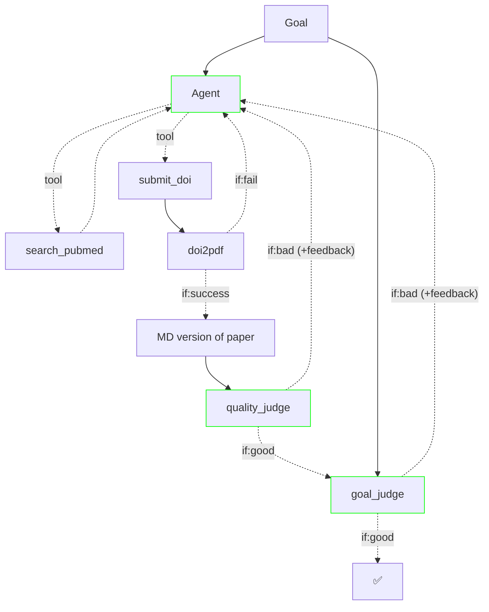

this is a project for the "Agentic AI Against Aging" hackathon

## Implementation
### Get papers

```mermaid
flowchart TD
    A["Goal"] --> C[Agent]:::ai
    C -. tool .-> B[search_pubmed] -..->
    C -. tool .-> D[submit_doi]
    D --> E[doi2pdf]
	    E -. if:fail .-> C
	    E -. if:success .-> F[MD version of paper]
    F --> G[quality_judge]:::ai
	    G -. if:good .-> H[goal_judge]:::ai
        G -. if:bad (+feedback) .-> C
    A --> H
	    H -. if:bad (+feedback) .-> C
	    H -. if:good .-> Z["✅"]
    
    
    %% Style human steps
    classDef human  ,stroke:#ff6f6f;
    classDef ai  ,stroke:#00ff00;
```